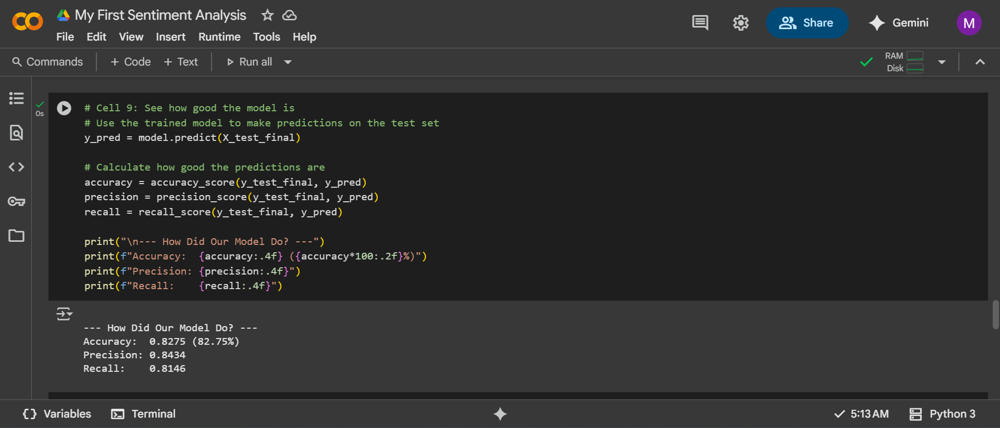
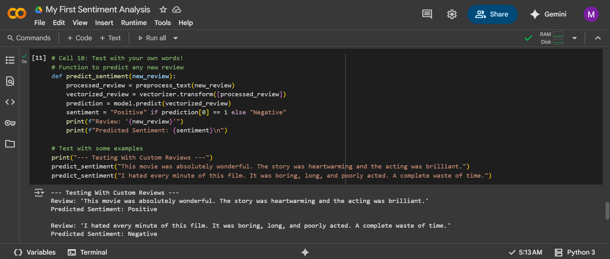

# Sentiment Analysis on IMDB Movie Reviews

## Project Overview
This project involves building a simple Logistic Regression model to perform binary sentiment classification on IMDB movie reviews. The goal is to classify a given review as either positive or negative.

## Tasks Completed
1.  **Data Acquisition:** Loaded the labeled IMDB movie reviews dataset from `tensorflow.keras.datasets`.
2.  **Text Preprocessing:**
    - Converted text to lowercase.
    - Removed special characters and numbers.
    - Removed English stopwords (using NLTK).
3.  **Feature Engineering:** Converted preprocessed text into numerical features using `CountVectorizer`.
4.  **Model Training:** Trained a Logistic Regression model on the training set.
5.  **Model Evaluation:** Evaluated the model on the test set using Accuracy, Precision, and Recall.
6.  **Prediction:** Used the trained model to predict sentiment on custom, user-written reviews.

## Results
The model achieved the following performance metrics on the test set:
- **Accuracy:** 82.75%
- **Precision:** 84.34%
- **Recall:** 81.46%

## Screenshots

### Evaluation Metrics

### Example Predictions on Custom Reviews

## How to Run
1.  Open the `My_First_Sentiment_Analysis.ipynb` notebook in Google Colab.
2.  Run all cells sequentially (`Runtime` -> `Run all`).
3.  The dataset will download automatically.
4.  The final cells will show the evaluation metrics and allow you to test custom reviews.

## Dependencies
- Python 3
- tensorflow
- scikit-learn
- nltk
- numpy
